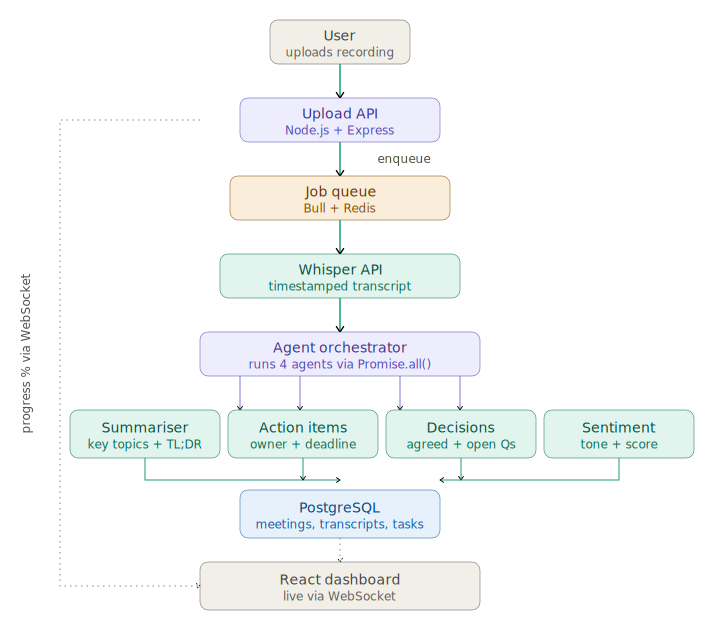

# AI Meeting Intelligence Platform

Upload any meeting recording. AI transcribes it, then 4 parallel LLM agents extract a summary, action items with owners and deadlines, decisions made, and meeting sentiment — all in under 60 seconds.

Built to solve a real problem: post-meeting documentation is manual, inconsistent, and usually skipped entirely. This automates it end to end.

---

---

## Architecture

<p align="center">
  
</p>

[](https://github.com/Abdulla-1234/AI-Meeting-Intelligence-Platform/actions/workflows/ci.yml)
[](https://nodejs.org)
[](https://react.dev)
[](https://groq.com)
[](https://postgresql.org)
[](https://redis.io)
[](#run-tests)
[](LICENSE)
---

## Features

- **Async transcription pipeline** — Bull + Redis job queue means large audio files never block the API; upload returns instantly with a job ID
- **4 parallel AI agents** — summariser, action-item extractor, decision detector, and sentiment analyser all run concurrently via `Promise.all()`, cutting total analysis time from ~40s to ~12s versus running them sequentially
- **Real-time progress** — WebSocket streams live transcription/analysis progress to the frontend, no polling needed
- **Action item tracking** — every extracted task carries an owner, deadline, and priority; toggle completion across all meetings from one dashboard
- **Sentiment analysis** — overall tone, energy level, and a 0–10 collaboration score per meeting
- **Decision log** — what was agreed and what questions remain open, extracted automatically
- **Tested** — 6 Jest tests validate all 4 agents and the full orchestration pipeline against the live Groq API
- **CI/CD** — GitHub Actions runs the full test suite against live Postgres + Redis containers on every push

---

## Tech Stack

| Layer | Technology |
|---|---|
| Frontend | React 18, Vite, TailwindCSS, React Query, React Router |
| Backend | Node.js, Express |
| AI / LLM | Groq (Llama 3.3 70B), LangChain |
| Transcription | Groq Whisper Large v3 |
| Queue | Bull + Redis |
| Database | PostgreSQL 15 |
| Real-time | WebSocket (`ws`) |
| Testing | Jest |
| Infra | Docker, Docker Compose |
| CI/CD | GitHub Actions |

---

## Quick Start

```bash
git clone https://github.com/Abdulla-1234/AI-Meeting-Intelligence-Platform.git
cd AI-Meeting-Intelligence-Platform

# Start Redis + PostgreSQL
docker compose up -d

# Backend
cd backend
npm install
cp .env.example .env   # add your GROQ_API_KEY
npm run dev

# Frontend (in a new terminal)
cd frontend
npm install
npm run dev
```

Open **http://localhost:5173** for the dashboard.

### Get a free Groq API key

1. Go to [console.groq.com](https://console.groq.com)
2. Sign up → **API Keys** → **Create API Key**
3. Paste it into `backend/.env` as `GROQ_API_KEY`

No credit card required — Groq's free tier covers both LLM inference and Whisper transcription.

---

## API Reference

| Method | Endpoint | Description |
|---|---|---|
| `POST` | `/api/meetings/upload` | Upload an audio/video file, starts async processing |
| `GET` | `/api/meetings` | List all meetings |
| `GET` | `/api/meetings/:id` | Full meeting detail — transcript, analysis, action items |
| `GET` | `/api/action-items` | All action items across all meetings |
| `PATCH` | `/api/action-items/:id` | Update an action item's status |

### Upload a meeting

```bash
curl -X POST http://localhost:4000/api/meetings/upload \
  -F "file=@meeting-recording.mp3" \
  -F "title=Sprint Planning"
```

### Track progress via WebSocket

```js
const ws = new WebSocket(`ws://localhost:4000?meetingId=${meetingId}`)
ws.onmessage = (e) => console.log(JSON.parse(e.data))
// { stage: 'transcribing', progress: 55, message: '...' }
```

---

## Run Tests

```bash
cd backend
npm test
```

6 tests validating:
- Summariser agent returns valid structured output
- Action item extractor finds tasks with owner/deadline
- Decision extractor separates decisions from open questions
- Sentiment analyser returns tone and collaboration score
- Full orchestrator pipeline runs all 4 agents in parallel and persists results to PostgreSQL

Tests call the live Groq API — full suite runs in under 10 seconds.

---

## CI/CD Pipeline

Every push to `main` triggers a GitHub Actions workflow that:

1. Spins up live PostgreSQL and Redis containers
2. Installs dependencies
3. Runs the full Jest suite against the real Groq API and databases
4. Reports pass/fail via the badge at the top of this README

See [`.github/workflows/ci.yml`](.github/workflows/ci.yml).

---

## Project Structure

```
AI-Meeting-Intelligence-Platform/
├── backend/
│   ├── src/
│   │   ├── agents/
│   │   │   ├── summariser.js      meeting summary agent
│   │   │   ├── actionItems.js     task extraction agent
│   │   │   ├── decisions.js       decision + open question agent
│   │   │   ├── sentiment.js       tone + collaboration scoring agent
│   │   │   └── orchestrator.js    runs all 4 agents in parallel
│   │   ├── workers/
│   │   │   └── transcription.js   Bull queue worker — Whisper + agent pipeline
│   │   ├── api/
│   │   │   └── upload.js          REST endpoints
│   │   ├── ws/
│   │   │   └── progress.js        WebSocket progress broadcaster
│   │   ├── db/
│   │   │   ├── postgres.js
│   │   │   └── redis.js
│   │   └── server.js
│   ├── tests/
│   │   └── agents.test.js
│   └── docker-compose.yml
│
├── frontend/
│   └── src/
│       ├── pages/
│       │   ├── Home.jsx           meeting list + upload
│       │   ├── MeetingDetail.jsx  full analysis view
│       │   └── ActionItems.jsx    cross-meeting task tracker
│       ├── components/
│       │   ├── UploadModal.jsx
│       │   ├── MeetingCard.jsx
│       │   └── ProgressBar.jsx
│       └── hooks/
│           └── useWebSocket.js
│
├── .github/workflows/ci.yml
└── README.md
```

---

## Design Decisions

**Why 4 separate agents instead of one large prompt?**
Each agent has a narrow, focused system prompt tuned for exactly one task. A single monolithic prompt asked to summarise, extract tasks, find decisions, and score sentiment simultaneously produces noticeably worse output on all four compared to four specialised prompts. Running them concurrently via `Promise.all()` also means total latency is bounded by the slowest single agent (~12s) rather than the sum of all four (~40s).

**Why a job queue instead of processing synchronously?**
A 60-minute recording takes 45–90 seconds to transcribe. Doing this inside the HTTP request risks timeouts and blocks the server from handling other requests. The queue lets the upload API return instantly with a job ID while a background worker processes the file — the same pattern AWS SQS and Celery use in production.

**Why WebSocket instead of polling for progress?**
Polling every few seconds wastes requests and adds latency to the UI feeling "live." WebSocket pushes progress updates to the client the moment the worker emits them, so the progress bar updates in real time with zero wasted requests.

**Why Groq over OpenAI for both LLM and transcription?**
Groq's LPU inference is dramatically faster than standard GPU-based inference, which matters directly for this project's "under 60 seconds" goal. It's also free to use for both chat completion and Whisper transcription, with no credit card required — important for a portfolio project others should be able to run and verify themselves.

---

## License

MIT — see [LICENSE](LICENSE)

---

Built by [Doodakula Mohammad Abdulla](https://github.com/Abdulla-1234)
